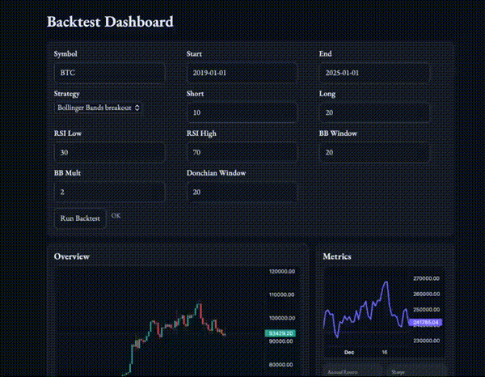

# Backtest Dash

A lightweight quantitative backtesting and visualization tool with a FastAPI + Pydantic backend and a vanilla JavaScript frontend. It supports parameterized strategies, indicator overlays, buy/sell markers, and interactive zooming.

## Overview
<p align="center">

</p>


## Features
- Backtest engine generating equity curve and buy/sell markers
- Strategies: SMA/EMA, MACD, RSI, Bollinger Bands, Donchian (Keep updating)
- Indicator overlays: draw continuous curves (SMA/EMA/BBands/RSI/MACD) on the candlestick chart


## Project Structure
- `backend/main.py`: FastAPI service, serves static frontend, routes and validation
- `core/`
  - `data_loader.py`: `yfinance` download with fallback
  - `backtester.py`: equity curve, buy/sell markers, signal output
  - `metrics.py`: annual return, volatility, drawdown, Sharpe
- `frontend/index.html`: page and styles
- `frontend/app.js`: fetching, chart rendering, interactions

## Quick Start
```bash
pip install fastapi uvicorn pandas yfinance
cd backend
uvicorn main:app --host 127.0.0.1 --port 8000 --reload
```
Open: `http://127.0.0.1:8000/`

## Usage
- Fill `Symbol`, `Start`, `End`, `Strategy` and params, then click “Run Backtest”
- Charts
  - `Overview`: quick candlestick preview
  - `Metrics` + `Equity`: KPIs and equity curve
  - `Backtest Candles & Signals`: candlesticks + buy/sell markers + strategy overlays

## API
- `GET /ohlcv?symbol=...&start=YYYY-MM-DD&end=YYYY-MM-DD` — daily OHLCV
- `GET /backtest?...` — returns `curve` (`dates`, `equity_curve`, `buy_signals`, `sell_signals`, `signal`) and `metrics`
  - `strategy`: `sma`, `ema`, `macd`, `rsi`, `bbands`, `donchian`

## Tech Stack
- Backend: `FastAPI`, `Pydantic`, `Uvicorn`
- Quant: `NumPy`, `Pandas`
- Data: `yfinance`
- Frontend: vanilla `JavaScript`, `Lightweight Charts`, `HTML/CSS`
